# 高级matlab数学建模：使用app

## 曲线拟合器

## 分布拟合器

## 偏微分方程求解器(PDE Modeler)

在app工具栏中打开pde modeler，将出现如下页面：

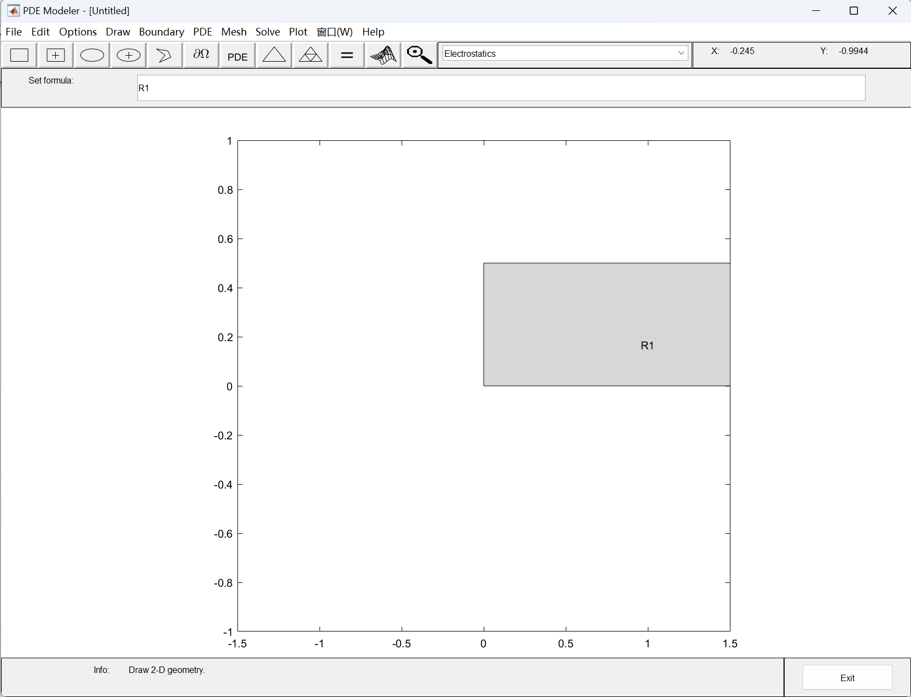

在工具栏file中可以选择导出m代码和图片，在options选项中可以改变坐标范围，在draw选项中可以绘制求解区域，在boundary中可以设置边界条件，在pde选项中可以设置微分方程类型和参数，在solve选项中可以对模型进行求解，在plot选项中可以设置绘图格式。

示例：

现给出热传导方程的经典问题（2018年国赛A题，2023年华数杯A题均可转化为以下模型）：

细杆导热问题：细杆初始温度均匀分布，值为u0，一端保持u0不变，另一端有强度q0的热流流入，求细杆的温度分布：
```math
\begin{cases}\frac{\partial u}{\partial t} =a^{2}\frac{\partial^{2} u}{\partial x^{2}}  \\u|_{x=0}=u_{0},\frac{\partial u}{\partial x} |_{x=l}=\frac{q_{0}}{k}  \\u|_{t=0}=u_{0}\end{cases}
```
其中u0，q0，k，a均为常数。上述问题是存在通解的，具体方法见数学物理方程教材：
```math
u(x,t)=u_{0}+\frac{q_{0}}{k} x+\frac{8q_{0}l}{k\pi ^{2}} \sum_{n=0}^{\infty } (-1)^{n+1}\frac{1}{(2n+1)^{2}} e^{-\frac{a^{2}(2n+1)^{2}\pi ^{2}}{4l^{2}} t}sin\frac{(2n+1)\pi}{2l} x
```
下面给出数值解计算方法：

步骤1：在options中选择axes limits更改坐标范围（这里以l=10为例，所以要更改）

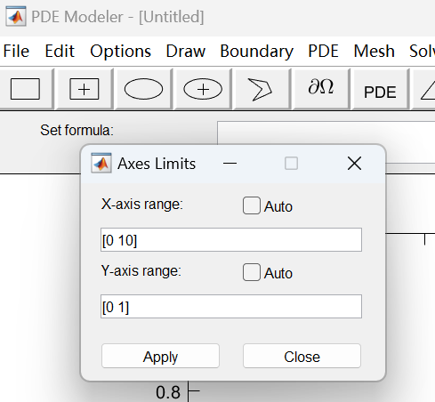

步骤2：在命令行中设置求解区域

```matlab
>> pderect([0,10,0,0.1])
```

如下图所示，条形区域R1即为求解区域

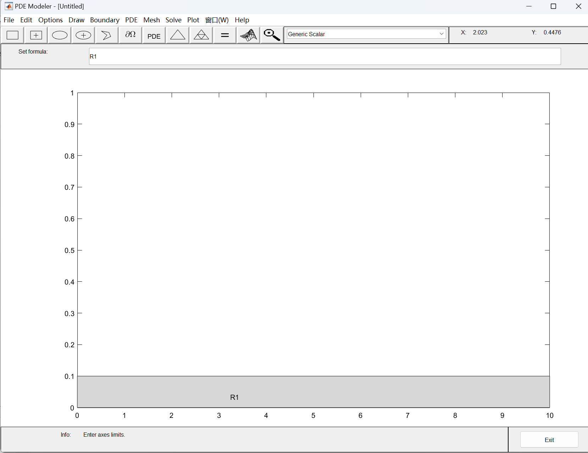

步骤3：在类型中选择热传导方程heat transfer

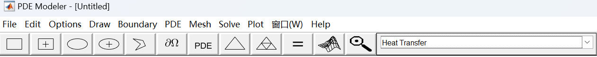

然后点击偏微分算符即(偏导欧米伽)按钮选中求解区域。

步骤4：设置边界条件：

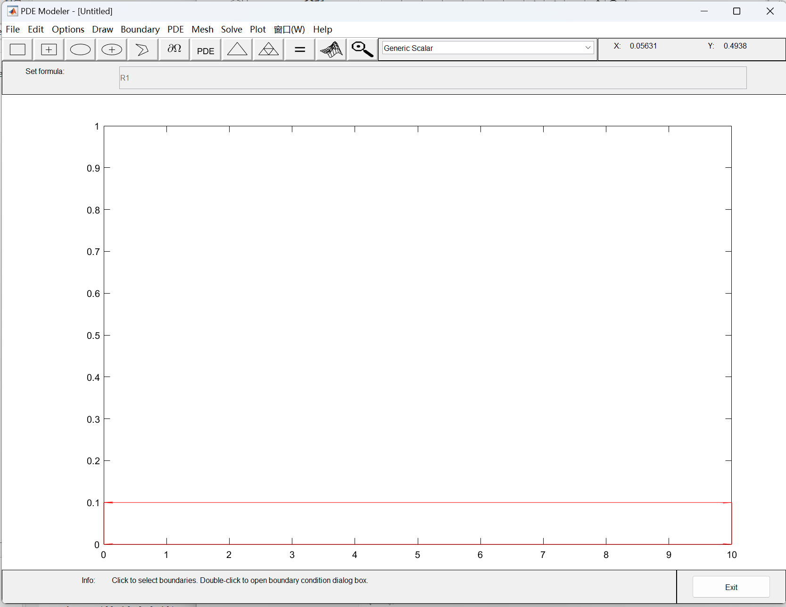

双击每条边框即可设置边界条件，点击左侧x=0的边：

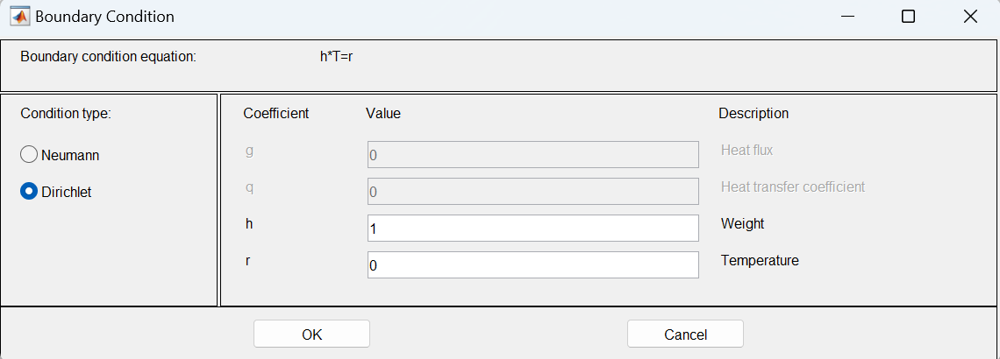

注意到condition type为Dirichlet条件：
```math
u|_{x=x_{0}}=\frac{r}{h}\space or\space u|_{S}=\frac{r(t)}{h(t)}
```
这里假设u0=25,故可设置h=1，r=25。

点击下方y=0的边，由于我们需要求解的方程是一维的，所以需要将上下两侧的边界条件r和h值均设置为0*。

点击右侧x=10的边：

由于边界条件为：
```math
\frac{\partial u}{\partial x} |_{x=l}=\frac{q_{0}}{k}
```
故选择Neumann条件：
```math
\vec{n_{S}} \cdot grad(u|_{S})+q(t)\cdot u|_{S}=g(t)
```
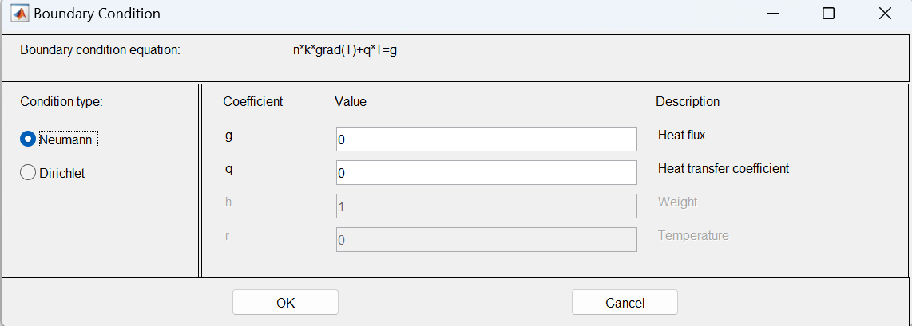

注意到q就是物体传热系数，g为热流密度。

当物体表面于外部介质有热量交换时，Neumann条件应当表示为：
```math
\vec{n_{S}} \cdot grad(u|_{S})+\frac{k_{1}}{k}u|_{S}=\frac{k_{1}}{k}u_{1}
```
其中k1为对流换热系数，k为物体自身的传热系数，u1为外部介质温度。该条件由牛顿冷却定律推得，具体过程见数学物理方法教材。不过matlab将对流换热问题整合进了pde方程中。

针对本题，q=0，取g=q0/k=0.23。

步骤5：点击选项栏中的三角形进行差分

步骤6：设置pde参数

点击pde选项中的pde specification：

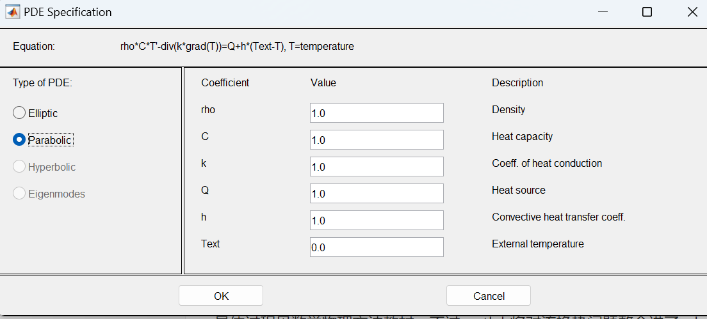

在type of pde中选择parabolic，可以注意到内热源于对流换热问题均被考虑在pde方程中了，其一般形式：
```math
\frac{\partial u}{\partial t} =\frac{k}{\rho c} (\frac{\partial^{2} u}{\partial x^{2}} +\frac{\partial^{2} u}{\partial y^{2}})+\frac{h}{\rho c}(u_{1}-u)+\frac{1}{\rho c} q(x,y,t) 
```
其中k为物体自身的传热系数，h为对流换热系数，\rho为物体密度，c为物体比热容，q为内热源温度，u1(text)为外部介质温度。

在这个问题中，设a方=k/(rho*c)=0.86，h=0，q=0，u1(text)=25。

步骤7：选择求解参数

在solve选项中选择solve parameters：

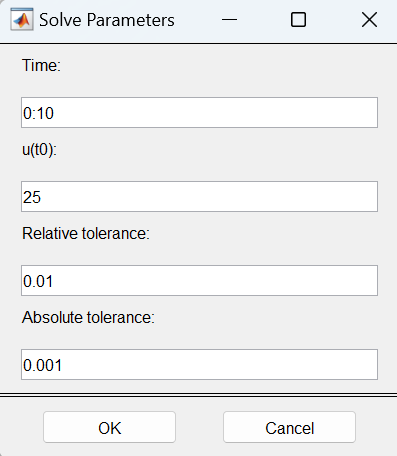

选择求解时间为0:10，初始温度u(t0)=25，当然也可以设置为关于x和y的函数。

步骤8：选择绘图参数

在plot选项中选择 plot parameters：

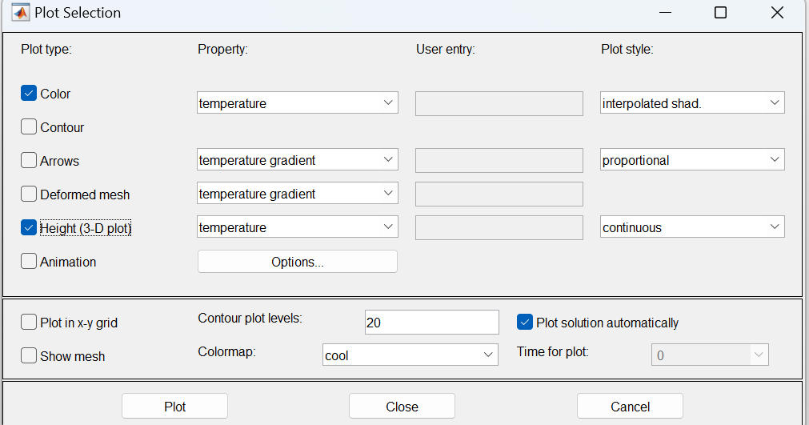

一般选择3d绘图。

步骤9：点击solve或=号求解

效果如下：

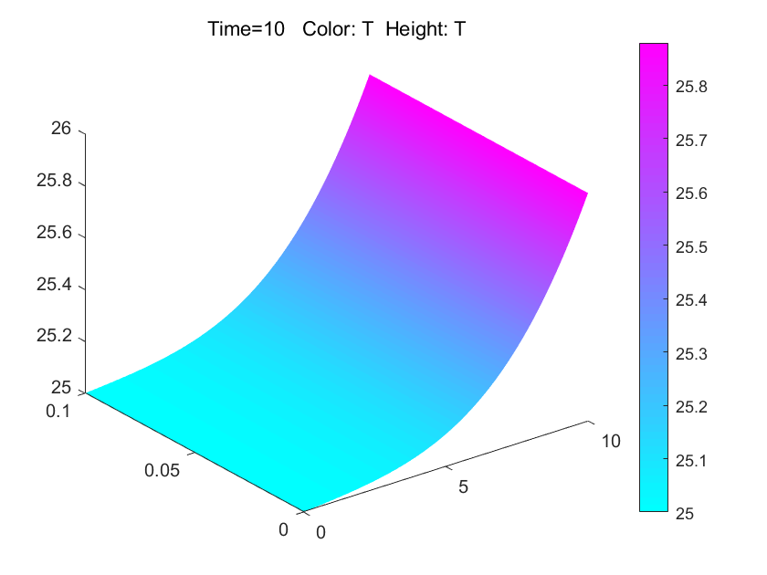

步骤10：在file选项中保存m文件生成代码
